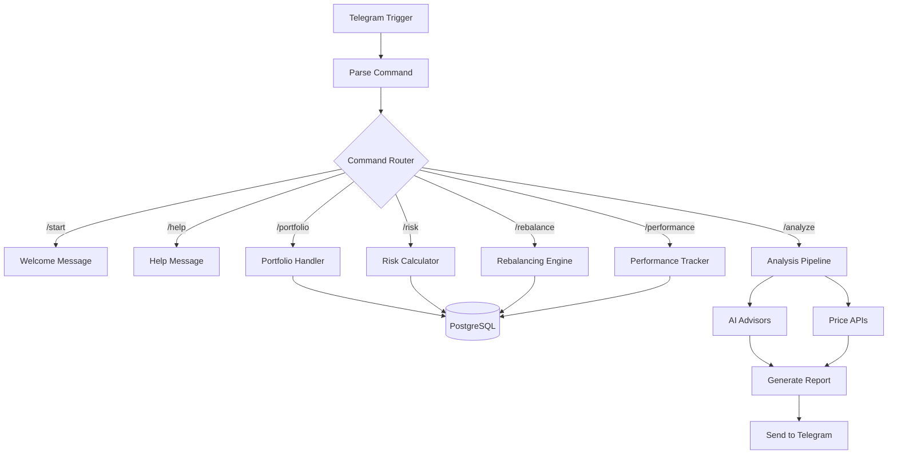

#  AFIS – Autonomous Financial Intelligence System

A sophisticated **n8n-based portfolio management system** that integrates AI advisors, real-time market data, and risk analytics via Telegram.


---

##  Features

###  Portfolio Management
- **Multi-Asset Support**: Stocks, Crypto, Commodities, and Bonds
- **Persistent Storage**: PostgreSQL-backed portfolio storage
- **Real-Time Pricing**: Multi-source price feeds with automatic fallbacks

###  AI Advisors
Receive investment insights from AI-powered financial personas:
- **Warren Buffett** – Value Investing
- **Ray Dalio** – Macro & Risk Parity
- **Cathie Wood** – Disruptive Innovation
- **Bill Ackman** – Activist Approach
- **Michael Burry** – Contrarian Analysis

###  Risk Analytics
- Sharpe Ratio & Volatility
- Value at Risk (VaR 95%)
- Maximum Drawdown
- Beta Analysis
- Concentration Risk Assessment

###  Rebalancing
- Automatic drift detection
- Target allocation comparison
- Actionable rebalancing suggestions

###  Price Fallback Chain
The system ensures reliable pricing with automatic fallbacks:
1. **Primary API** (Polygon.io / CoinGecko / TwelveData)
2. **Yahoo Finance** (free fallback)
3. **Cached prices** (if available)
4. **Zero with error flag** (last resort)

---

##  Quick Start

### Prerequisites
- [n8n](https://n8n.io/) (self-hosted or cloud)
- PostgreSQL Database
- Telegram Bot Token (from [@BotFather](https://t.me/BotFather))
- **OpenAI API Key** (GPT-4 recommended, GPT-3.5-turbo works)

#### Optional API Keys:
| API | Purpose | Free Tier |
|-----|---------|-----------|
| [Polygon.io](https://polygon.io/) | Stocks | 5 calls/min |
| [TwelveData](https://twelvedata.com/) | Commodities | 800 calls/day |
| [CoinGecko](https://www.coingecko.com/en/api) | Crypto | No key needed (10-50 calls/min) |

### Installation

1. **Clone the repository**
   ```bash
   git clone https://github.com/OliverKlug/afis-n8n.git
   cd afis-n8n
   ```

2. **Import the workflow**
   - Open n8n
   - Go to **Settings → Import Workflow**
   - Select the workflow JSON file

3. **Configure credentials**
   - Add your Telegram Bot credentials
   - Add PostgreSQL connection
   - Add OpenAI API key
   - Add API keys for Polygon and TwelveData (optional)

4. **Set up the database**
   ```sql
   -- Portfolios table
   CREATE TABLE portfolios (
     id SERIAL PRIMARY KEY,
     user_id BIGINT UNIQUE NOT NULL,
     username VARCHAR(255),
     holdings JSONB NOT NULL,
     created_at TIMESTAMPTZ DEFAULT NOW(),
     updated_at TIMESTAMPTZ DEFAULT NOW()
   );

   -- Portfolio snapshots
   CREATE TABLE portfolio_snapshots (
     id SERIAL PRIMARY KEY,
     user_id BIGINT NOT NULL,
     total_value DECIMAL(15,2),
     holdings JSONB,
     metrics JSONB,
     created_at TIMESTAMPTZ DEFAULT NOW()
   );

   -- Indexes for performance
   CREATE INDEX idx_portfolios_user 
     ON portfolios(user_id);
   CREATE INDEX idx_snapshots_user_date 
     ON portfolio_snapshots(user_id, created_at DESC);
   ```

5. **Activate the workflow** and start the Telegram bot

---

## Telegram Commands

| Command | Description |
|---------|-------------|
| `/start` | Welcome message and feature overview |
| `/help` | Complete command reference |
| `/portfolio AAPL:100,BTC:0.5` | Set portfolio holdings |
| `/portfolio` | View current portfolio |
| `/analyze` | Get AI advisor insights |
| `/risk` | Portfolio risk analysis |
| `/rebalance` | Rebalancing recommendations |
| `/performance` | Historical performance data |

### Portfolio Format
```
/portfolio SYMBOL:QUANTITY,SYMBOL:QUANTITY
```

**Examples:**
```
/portfolio AAPL:100,MSFT:50,GOOGL:25
/portfolio BTC:1.5,ETH:10,SOL:200
/portfolio AAPL:100,BTC:0.5,GOLD:50,TLT:25
```

---

##  Supported Assets

| Category | Symbols |
|----------|---------|
| **Stocks** | AAPL, MSFT, GOOGL, AMZN, TSLA, NVDA, META, etc. |
| **Crypto** | BTC, ETH, SOL, ADA, XRP, DOGE, MATIC, DOT, AVAX, LINK |
| **Commodities** | GOLD, SILVER, OIL, GAS, COPPER, PLATINUM |
| **Bonds** | TLT, AGG, BND, IEF, SHY, LQD, HYG |

---

##  Architecture


```mermaid
flowchart TB
    A[Telegram Trigger] --> B[Parse Command]
    B --> C{Command Router}
    
    C -->|/start| D[Welcome Message]
    C -->|/help| E[Help Message]
    C -->|/portfolio| F[Portfolio Handler]
    C -->|/analyze| G[Analysis Pipeline]
    C -->|/risk| H[Risk Calculator]
    C -->|/rebalance| I[Rebalancing Engine]
    C -->|/performance| J[Performance Tracker]
    
    F --> K[(PostgreSQL)]
    G --> L[AI Advisors]
    G --> M[Price APIs]
    H --> K
    I --> K
    J --> K
    
    L --> N[Generate Report]
    M --> N
    N --> O[Send to Telegram]
```

---

##  Risk Metrics Explained

| Metric | Description |
|--------|-------------|
| **Sharpe Ratio** | Risk-adjusted return (higher = better) |
| **Volatility** | Annualized standard deviation |
| **VaR (95%)** | Maximum expected loss at 95% confidence |
| **Max Drawdown** | Largest peak-to-trough decline |
| **Beta** | Correlation with market movements |

---

##  Configuration

### Required Credentials

| Credential | Description | How to Get |
|------------|-------------|------------|
| `TELEGRAM_BOT_TOKEN` | Telegram Bot API token | [@BotFather](https://t.me/BotFather) |
| `POSTGRES_*` | Database connection | Local or cloud (Supabase, etc.) |
| `OPENAI_API_KEY` | OpenAI API key | [platform.openai.com](https://platform.openai.com) |

### Optional API Keys

| Credential | Description | Rate Limit |
|------------|-------------|------------|
| `POLYGON_API_KEY` | Stock prices | 5 calls/min (free) |
| `TWELVEDATA_API_KEY` | Commodity prices | 800 calls/day (free) |
| CoinGecko | Crypto prices | No key needed |

### Target Allocations (Customizable)

Default rebalancing targets:
```javascript
{
  'Stock': 40,
  'Crypto': 20,
  'Bond': 25,
  'Commodity': 15
}
```

---

##  Disclaimer

> **This is not financial advice.** This tool is for educational and informational purposes only. Always consult a licensed financial advisor before making investment decisions. Past performance does not guarantee future results.

---

##  Contributing

Contributions are welcome! Please feel free to submit a Pull Request.

1. Fork the repository
2. Create your feature branch (`git checkout -b feature/AmazingFeature`)
3. Commit your changes (`git commit -m 'Add some AmazingFeature'`)
4. Push to the branch (`git push origin feature/AmazingFeature`)
5. Open a Pull Request

---

##  Contact

For questions or support, open an issue on GitHub.

---

---

##  Note

This README was created with AI assistance. While the content accurately describes the project, please verify technical details against the actual implementation.

---

<p align="center">
  <b>Built with ❤️ using n8n and AI</b>
</p>

