# afis-n8n
Autonomous Multi-Agent System for Financial Analysis using n8n and LLMs.
# 🤖 AFIS

A sophisticated **n8n-based portfolio management system** that integrates AI advisors, real-time market data, and risk analytics via Telegram.


---

##  Features

### 📊 Portfolio Management
- **Multi-Asset Support**: Stocks, Crypto, Commodities, and Bonds
- **Persistent Storage**: PostgreSQL-backed portfolio storage
- **Real-Time Pricing**: Multi-source price feeds with fallbacks

### 🧠 AI Advisors
Receive investment insights from AI-powered financial personas:
- **Warren Buffett** – Value Investing
- **Ray Dalio** – Macro & Risk Parity
- **Cathie Wood** – Disruptive Innovation
- **Bill Ackman** – Activist Approach
- **Michael Burry** – Contrarian Analysis

### 📈 Risk Analytics
- Sharpe Ratio & Volatility
- Value at Risk (VaR 95%)
- Maximum Drawdown
- Beta Analysis
- Concentration Risk Assessment

### ⚖️ Rebalancing
- Automatic drift detection
- Target allocation comparison
- Actionable rebalancing suggestions

---

## 🚀 Quick Start

### Prerequisites
- [n8n](https://n8n.io/) (self-hosted or cloud)
- PostgreSQL Database
- Telegram Bot Token
- API Keys:
  - [Polygon.io](https://polygon.io/) (Stocks)
  - [CoinGecko](https://www.coingecko.com/en/api) (Crypto)
  - [TwelveData](https://twelvedata.com/) (Commodities)

### Installation

1. **Clone the repository**
   ```bash
   git clone https://github.com/yourusername/ai-hedge-fund.git
   cd ai-hedge-fund
   ```

2. **Import the workflow**
   - Open n8n
   - Go to **Settings → Import Workflow**
   - Select `agentic-market-reasoning.json`

3. **Configure credentials**
   - Add your Telegram Bot credentials
   - Add PostgreSQL connection
   - Add API keys for Polygon, CoinGecko, and TwelveData

4. **Set up the database**
   ```sql
   CREATE TABLE portfolios (
     id SERIAL PRIMARY KEY,
     user_id BIGINT NOT NULL,
     username VARCHAR(255),
     holdings JSONB NOT NULL,
     created_at TIMESTAMP DEFAULT NOW()
   );

   CREATE TABLE portfolio_snapshots (
     id SERIAL PRIMARY KEY,
     user_id BIGINT NOT NULL,
     total_value DECIMAL(15,2),
     holdings JSONB,
     metrics JSONB,
     created_at TIMESTAMP DEFAULT NOW()
   );
   ```

5. **Activate the workflow** and start the Telegram bot

---

## 💬 Telegram Commands

| Command | Description |
|---------|-------------|
| `/start` | Welcome message and feature overview |
| `/help` | Complete command reference |
| `/portfolio AAPL:100,BTC:0.5` | Set portfolio holdings |
| `/portfolio` | View current portfolio |
| `/analyze` | Get AI advisor insights |
| `/risk` | Portfolio risk analysis |
| `/rebalance` | Rebalancing recommendations |
| `/performance` | Historical performance data |

### Portfolio Format
```
/portfolio SYMBOL:QUANTITY,SYMBOL:QUANTITY
```

**Examples:**
```
/portfolio AAPL:100,MSFT:50,GOOGL:25
/portfolio BTC:1.5,ETH:10,SOL:200
/portfolio AAPL:100,BTC:0.5,GOLD:50,TLT:25
```

---

## 🏦 Supported Assets

| Category | Symbols |
|----------|---------|
| **Stocks** | AAPL, MSFT, GOOGL, AMZN, TSLA, NVDA, META, etc. |
| **Crypto** | BTC, ETH, SOL, ADA, XRP, DOGE, MATIC, DOT, AVAX, LINK |
| **Commodities** | GOLD, SILVER, OIL, GAS, COPPER, PLATINUM |
| **Bonds** | TLT, AGG, BND, IEF, SHY, LQD, HYG |

---

## 🔧 Architecture

```mermaid
flowchart TB
    A[Telegram Trigger] --> B[Parse Command]
    B --> C{Command Router}
    
    C -->|/start| D[Welcome Message]
    C -->|/help| E[Help Message]
    C -->|/portfolio| F[Portfolio Handler]
    C -->|/analyze| G[Analysis Pipeline]
    C -->|/risk| H[Risk Calculator]
    C -->|/rebalance| I[Rebalancing Engine]
    C -->|/performance| J[Performance Tracker]
    
    F --> K[(PostgreSQL)]
    G --> L[AI Advisors]
    G --> M[Price APIs]
    H --> K
    I --> K
    J --> K
    
    L --> N[Generate Report]
    M --> N
    N --> O[Send to Telegram]
```



---

## 📊 Risk Metrics Explained

| Metric | Description |
|--------|-------------|
| **Sharpe Ratio** | Risk-adjusted return (higher = better) |
| **Volatility** | Annualized standard deviation |
| **VaR (95%)** | Maximum expected loss at 95% confidence |
| **Max Drawdown** | Largest peak-to-trough decline |
| **Beta** | Correlation with market movements |

---

## ⚠️ Disclaimer

> **This is not financial advice.** This tool is for educational and informational purposes only. Always consult a licensed financial advisor before making investment decisions. Past performance does not guarantee future results.

---

## 🛠️ Configuration

### Environment Variables

| Variable | Description |
|----------|-------------|
| `TELEGRAM_BOT_TOKEN` | Your Telegram Bot API token |
| `POSTGRES_HOST` | PostgreSQL host |
| `POSTGRES_DB` | Database name |
| `POLYGON_API_KEY` | Polygon.io API key |
| `TWELVEDATA_API_KEY` | TwelveData API key |

### Target Allocations (Customizable)

Default rebalancing targets:
```javascript
{
  'Stock': 40,
  'Crypto': 20,
  'Bond': 25,
  'Commodity': 15
}
```

---

## 📝 License

MIT License - see [LICENSE](LICENSE) for details.

---

## 🤝 Contributing

Contributions are welcome! Please feel free to submit a Pull Request.

1. Fork the repository
2. Create your feature branch (`git checkout -b feature/AmazingFeature`)
3. Commit your changes (`git commit -m 'Add some AmazingFeature'`)
4. Push to the branch (`git push origin feature/AmazingFeature`)
5. Open a Pull Request

---

## 📧 Contact

For questions or support, open an issue on GitHub.

---
---
## 📝 Note

This README was created with AI assistance. While the content accurately describes the project, please verify technical details against the actual implementation.


**Built with ❤️ using n8n**
